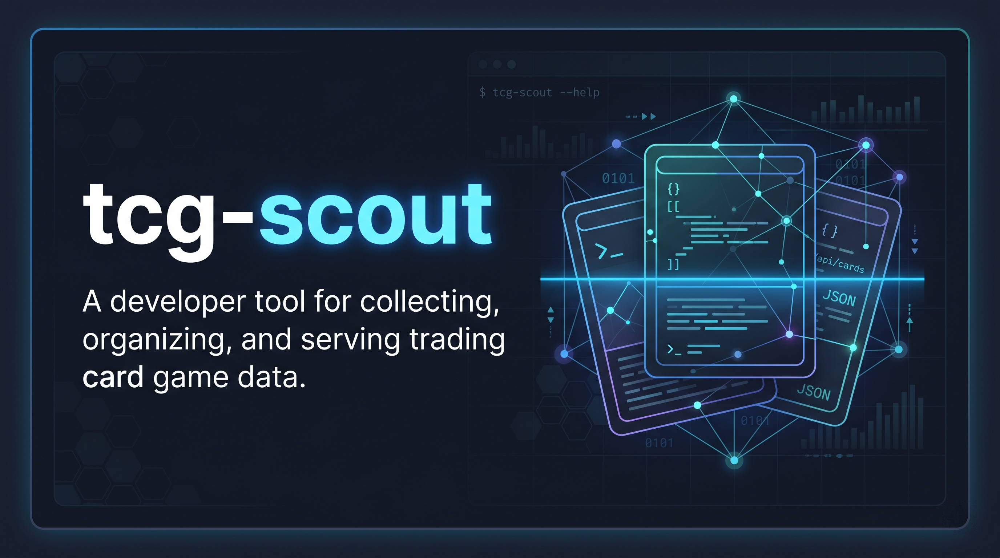

# tcg-scout

`tcg-scout` is a production-oriented Go tool for **multi-game TCG scraping**. It now uses a **hexagonal-lite** layout with:

- a shared application registry for **games**, **resources**, **scrapers**, and **actions**
- a Cobra + Viper CLI for interactive and automated workflows
- an HTTP API that exposes the same discovery and execution surface as the CLI

Today the project ships with:

- `sve` game: **Shadowverse Evolve**
- `cards` resource
- `official` scraper
- supported actions: `scrape`, `list`, `images`

The structure is ready to grow into more games and more scraper adapters for `cards` and `decks`.

## Architecture

```text
cmd/tcg-scout               # main entrypoint
internal/app                # shared registry + execution service
internal/cli                # Cobra/Viper CLI adapter
internal/api                # HTTP API adapter
internal/tcg/sve/cards      # Shadowverse Evolve cards runner
internal/scraper            # scraping engine
```

The shared service is the contract between adapters and scraper implementations:

- the **CLI** discovers and runs scrapers through it
- the **API** exposes the same capabilities through HTTP
- each scraper registers metadata once and becomes available everywhere

## Requirements

- Go `1.24+`

## Quick start

1. Install dependencies:

   ```bash
   go mod tidy
   ```

2. Run the interactive CLI:

   ```bash
   go run ./cmd/tcg-scout
   ```

3. Or run a command directly:

   ```bash
   go run ./cmd/tcg-scout sve cards official scrape
   ```

## CLI usage

### Interactive mode

Running the binary with no arguments opens a guided prompt when attached to a terminal:

```bash
go run ./cmd/tcg-scout
```

You can also start it explicitly:

```bash
go run ./cmd/tcg-scout interactive
```

### Discovery commands

List games:

```bash
go run ./cmd/tcg-scout games
```

List resources for a game:

```bash
go run ./cmd/tcg-scout resources sve
```

List scrapers for a resource:

```bash
go run ./cmd/tcg-scout scrapers sve cards
```

### Action commands

Scrape cards and refresh `cards.json` plus WEBP art:

```bash
go run ./cmd/tcg-scout sve cards official scrape
```

List cards without writing files:

```bash
go run ./cmd/tcg-scout sve cards official list
```

Rebuild images from an existing JSON file:

```bash
go run ./cmd/tcg-scout sve cards official images
```

### Output formats

The CLI supports `auto`, `table`, `plain`, and `json` output:

```bash
go run ./cmd/tcg-scout games --output json
go run ./cmd/tcg-scout sve cards official list --output table
go run ./cmd/tcg-scout sve cards official list --output plain
```

`auto` is the default:

- terminal output -> table
- non-terminal output -> plain

### Shared scraper flags

The action commands support the same configuration surface:

```bash
go run ./cmd/tcg-scout sve cards official scrape \
  --search-url "https://en.shadowverse-evolve.com/cards/searchresults/?expansion_name=BP17" \
  --output-json output/cards.json \
  --images-dir output/images \
  --user-agent "tcg-scout/1.0" \
  --webp-quality 90 \
  --image-concurrency 8 \
  --page-concurrency 4
```

Available flags:

| Flag | Purpose |
| --- | --- |
| `--search-url` | Override the upstream card search URL |
| `--output-json` | Change where card JSON is written |
| `--images-dir` | Change where WEBP images are written |
| `--user-agent` | Override the HTTP user agent |
| `--allowed-domain` | Restrict scraper requests to one domain |
| `--webp-quality` | Set WEBP quality from `0` to `100` |
| `--image-concurrency` | Control concurrent image downloads |
| `--page-concurrency` | Control concurrent paginated fetches |

## Compatibility aliases

Legacy entrypoints are still supported:

```bash
go run ./cmd/tcg-scout -names-only
go run ./cmd/tcg-scout images-only
go run ./cmd/tcg-scout -search-url "https://example.com"
go run ./cmd/tcg-scout sve cards scrape
```

They are internally rewritten to the new command tree:

- `-names-only` -> `sve cards official list`
- `images-only` -> `sve cards official images`
- legacy flag-only scrape -> `sve cards official scrape`
- `sve cards scrape` -> `sve cards official scrape`

## Configuration

Configuration is layered in this order:

1. CLI flags
2. environment variables
3. config file
4. built-in defaults

### Environment variables

All keys use the `TCG_SCOUT_` prefix:

```bash
export TCG_SCOUT_OUTPUT=json
export TCG_SCOUT_LOG_LEVEL=debug
export TCG_SCOUT_SEARCH_URL="https://en.shadowverse-evolve.com/cards/searchresults/?expansion_name=BP17"
```

### Config file

The CLI looks for `.tcg-scout.yaml` in the current directory or home directory, unless `--config` is provided.

Example:

```yaml
log-level: info
output: auto
search-url: https://en.shadowverse-evolve.com/cards/searchresults/?expansion_name=BP17
output-json: output/cards.json
images-dir: output/images
user-agent: tcg-scout/1.0
webp-quality: 100
image-concurrency: 8
page-concurrency: 4
server-addr: :8080
server-read-timeout: 5s
server-write-timeout: 30s
server-idle-timeout: 60s
server-shutdown-timeout: 10s
```

## API usage

The same shared service is available over HTTP through the `serve` command.

### 1. Start the API

```bash
go run ./cmd/tcg-scout serve --addr :8080
```

### 2. Check health

```bash
curl http://localhost:8080/healthz
```

Expected response:

```json
{
  "status": "ok"
}
```

### 3. Discover supported games

```bash
curl http://localhost:8080/v1/games
```

### 4. Discover resources for a game

```bash
curl http://localhost:8080/v1/games/sve/resources
```

### 5. Discover scrapers for a resource

```bash
curl http://localhost:8080/v1/games/sve/resources/cards/scrapers
```

### 6. List cards through the API

```bash
curl -X POST http://localhost:8080/v1/runs \
  -H "Content-Type: application/json" \
  -d '{
    "game": "sve",
    "resource": "cards",
    "scraper": "official",
    "action": "list",
    "options": {
      "search_url": "https://en.shadowverse-evolve.com/cards/searchresults/?expansion_name=BP17"
    }
  }'
```

This returns structured JSON with:

- `summary`
- `cards`

### 7. Run a full scrape through the API

```bash
curl -X POST http://localhost:8080/v1/runs \
  -H "Content-Type: application/json" \
  -d '{
    "game": "sve",
    "resource": "cards",
    "scraper": "official",
    "action": "scrape",
    "options": {
      "search_url": "https://en.shadowverse-evolve.com/cards/searchresults/?expansion_name=BP17",
      "output_json_path": "output/cards.json",
      "images_dir": "output/images",
      "user_agent": "tcg-scout/1.0",
      "webp_quality": 100,
      "image_concurrency": 8,
      "page_concurrency": 4
    }
  }'
```

The response contains a summary describing:

- selected game/resource/scraper/action
- card count
- output JSON path
- images directory

### 8. Rebuild images from existing JSON through the API

```bash
curl -X POST http://localhost:8080/v1/runs \
  -H "Content-Type: application/json" \
  -d '{
    "game": "sve",
    "resource": "cards",
    "scraper": "official",
    "action": "images",
    "options": {
      "output_json_path": "output/cards.json",
      "images_dir": "output/images"
    }
  }'
```

### API error behavior

- `400` for invalid execution requests
- `404` for unknown game/resource discovery routes
- `200` for successful discovery and runs

## Build

Development build:

```bash
go build -o bin/tcg-scout ./cmd/tcg-scout
```

Versioned build:

```bash
go build \
  -ldflags "-X main.version=1.0.0 -X main.commit=$(git rev-parse --short HEAD 2>/dev/null || echo unknown) -X main.date=$(date -u +%Y-%m-%dT%H:%M:%SZ)" \
  -o bin/tcg-scout \
  ./cmd/tcg-scout
```

## Shell completion

```bash
go run ./cmd/tcg-scout completion bash
go run ./cmd/tcg-scout completion zsh
go run ./cmd/tcg-scout completion fish
go run ./cmd/tcg-scout completion powershell
```

## Development

Run tests:

```bash
go test ./...
```

Run the API locally:

```bash
go run ./cmd/tcg-scout serve
```

## Extending the catalog

To add another scraper:

1. Implement a new runner that satisfies the shared `internal/app.Runner` contract.
2. Register it in `cmd/tcg-scout/main.go`.
3. Expose the new game/resource/scraper metadata through the runner definition.

Once registered, the new scraper automatically becomes available to:

- interactive CLI flows
- discovery commands
- API discovery endpoints
- action execution paths
